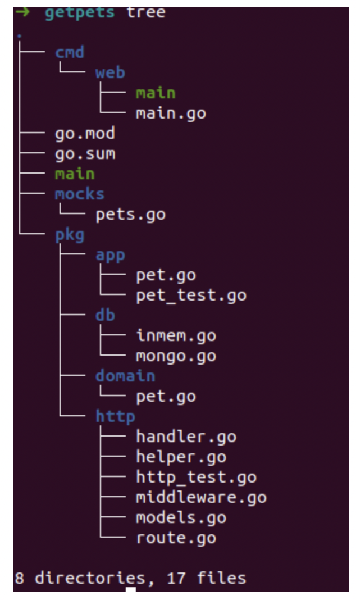

I. folder structure

* cmd:
    contains cmd command generated and handle by [Cobra](https://github.com/spf13/cobra) 
* internal:
    This folder is for internal logic that should not be imported from any other package
* pkg:
    The `pkg` folder is one of the most important ones, it contains core parts of the application logic which is intended to be imported by other packages
* models:
    If you’re working with any kind of database and a respective ORM to connect to it (e.g. gorm), a dedicated folder for these models makes sense
* api:
    If your application provides any API to connect to (e.g. gRPC, HTTP, …), the `api` folder is the correct location where to put any schemata or specification. You may also add the routes of the API endpoints here
* ui:
    If you’re aiming to create a GUI application (instead of or even in combination with a cli application), moving things that are UI-related in a specific folder is a good way to separate it from the rest
* lib:
    Bundling the core logic of the application to make it usable from the cli and the UI part. 
* scripts:
    In case your project requires some external scripts (e.g. bash, lua, …) it’s a good idea to put these scripts into a dedicated folder
* tools:
    If your project needs some external tools to do particular tasks (e.g. code generation) that are probably not intended to be installed globally (in contrast to e.g. Cobra)
* utils:
    This folder is probably the most dangerous of the ones presented here. In utils you can basically put everything that is not related to any particular part of logic but which is more a general helper that can be used in different places

II. Ref:
1. [My Favourite Go Project Structure](https://medium.com/@martengartner/my-favourite-go-project-setup-479563662834)
2. [project layout](https://github.com/golang-standards/project-layout)
3. [go-project-structure](https://dev.to/jinxankit/go-project-structure-and-guidelines-4ccm)
4. [Go Project Structure Best Practices](https://tutorialedge.net/golang/go-project-structure-best-practices/)
5. [i-ll-take-pkg-over-internal](https://travisjeffery.com/b/2019/11/i-ll-take-pkg-over-internal/)
6. [Standard Package Layout](https://medium.com/@benbjohnson/standard-package-layout-7cdbc8391fc1)
7. [Golang project structuring](https://medium.com/sellerapp/golang-project-structuring-ben-johnson-way-2a11035f94bc)